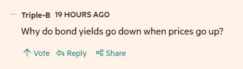

To some people, the answer to the subtitle of this post will be obvious. Perhaps even so obvious that you can't understand why anyone would even need to ask. Everybody knows this, right?

Wrong.

Even when it comes to parts of the press where you may think that the readership would definitely understand this, the fact that the [Financial Times](https://www.ft.com) tends to include the sentence "bond yields move inversely to prices" in every piece about bonds suggests that they know that this is not something that people know intuitively.

::: {.column-margin}

:::

So, why do prices move inversely to yields? Why do prices go down when yields go up? We should probably start with a more fundamental question to get everyone to same place. What exactly is a bond?

## What is a bond?

A bond is a financial instrument issued by a bank, a company, a government, to raise money. It is, in someways, rather like a loan, except that when you repay a loan, you tend to repay both the _principal_ (the amount initally borrowed) and the _interest_ at the same time, each month. With a bond, the interest is payable to you over time, each year (called coupons), and the principal - the original amount that was borrowed - will be repaid in one lump sum at the end of the term. A couple of simple examples to make this clear.

1. You go to your bank and ask for a £5,000 loan. The bank agrees to lend you this money at a rate of 5% per year and you will repay the loan over five years. You will need to repay the bank the _principal_ of £5,000 as well as interest of 5% per year. The total repayable is the original £5,000 plus the interest. The interest won't be 5% of £5,000 (£250) each year, because the 5% is charged on how much money you owe the bank. After one year of repayments, you will owe the bank less than £5,000, so the interest for year two will be smaller, as you will have repaid some of the principal by then. Neither you nor the bank particularly want your monthly payment to change throughout the period of the loan, so we use some nifty maths to work out the flat amount you should pay in each of the months to repay the loan and the interest.

2. The UK Government wants to build some fancy new infrastructure. It doesn't want to raise taxes to pay for it, so it's going to borrow it instead. Instead of going to a bank and asking for a loan, it issues a bond, often referred to as a _gilt_ in the UK (as they used to be issued on gold-edged paper to signify the safety of the repayer). It will sell this new debt into the financial markets offering a particular interest rate (called a _coupon_). Let's imagine the UK government has just issued a bond (gilt) of £100 over five years at 5%.

## How does a bond differ from a loan?

Where this now differs from the loan you may get from your bank is that the government sells its bond, and the person/institution that bought it sends their money to government. You now own a piece of paper that promises you that you will get your £100 back, in five years' time, plus a coupon payment (interest) of 5% (£5). This coupon payment is normally paid twice a year in two equal instalments. So, for our £100 bond, we're going to give the government £100 upfront, and we'll receive two payments of £2.50 each year totalling our £5: 5% interest per year. At the end of the five years, the government will return our original £100 to us. This means we'll have received 5 x £5 = £25 in coupons, plus our original £100.

In our example, you have lent the government £100 (the principal), and the government has paid you £25 (5% per year for 5 years) in coupons, plus returning the original principal to you. The price of the bond (£100), and the yield (5%) haven't changed, so where does all this talk of prices and yields moving inversely come from?

## Secondary markets

Most investors don't do what we've just explained: buy a bond, sit tight taking the twice-yearly coupon payments, and wait for the principal to be returned to us at the end of the term. Our example was of you holding your gilt until maturity. Buying a gilt, and holding it until it expires at the end of its term. Only around one-quarter to one-third of all gilts issued are held to maturity in this way, mostly by pension funds and insurers, looking for a long-term, stable and risk-free return on capital.

This means that most of the market, over two-thirds of all gilts, are traded (sold to someone else) within their lifetime. In fact, around 10% of the entire outstanding gilts market in the UK changes hands every week. These are known as the secondary markets.

It is here, in the secondary markets, that prices can move. It's important to note that the question I posed in the subtitle to this post (why do prices go down when yields go up) is not really the right question to ask. Yields aren't the thing that directly moves. What changes is the price and, because the price moves, the _implied_ yield moves, and it moves inversely. Prices go down: yields go up. Prices go up: yields go down. We should probably answer the next obvious question: how?

## Prices and yields

Let's go back to our original example. You buy a 5-year UK government gilt at 5%. You're feeling generous to the government, so you buy a huge £100's worth. Your investment calculation might look like this.

I buy a gilt at £100. It will pay me 5% per year (£2.50 coupon every six months). At the end of the term, after five years, I will have £125 from my initial £100 investment. After inflation at, say, 2% per year, that means that in real-terms, i.e. after inflation, I'll have made 3% per year, netting me a real return of £15 on my £100 investment.^[I know that I've simplified the numbers here and am not accounting for the compounding interest or inflation on the coupons. For now, we'll keep things simple, but I may revisit this idea in a future post.]

Imagine now that after one year, you have a sudden need to get your £100 back, so you're going to sell your bond to someone else in the secondary markets. The key question is what price will you be able to sell it for? You've already received two of your coupon payments totalling 5% of your bond. You've got your £5 in interest, and whoever you sell it to at this stage only has four years of coupons that they'll receive when they buy it. If they buy the bond from you at _face value_, i.e. £100, you're back where you started, and the new owner now has a four-year bond yielding 5%.

But what if the buyer of your bond is only prepared to give you £95 for it? Perhaps they're looking for a bargain, and think that you're in a weak bargaining position as you need your cash back? Or, more likely, what if the buyer of the bond thinks that inflation expectations over the next four years have changed since you bought the bond originally. We assumed inflation of 2% per year, but what if an American president was foolish enough to invade Iran and reduce the flow of global oil supplies? That might mean that inflation is now expected to be 3%. How does this change what the new buyer of the bond may pay for it?

Well, with inflation unchanged, the new bond buyer, if the pay face value (£100), will earn four years of coupons at 5% (£20), and after inflation at 2%, this is a 3% real return (£12). But if the new buyer thinks 3% inflation is more likely, that cash return from the coupons of £20 will no longer be worth £12, but only £8 (4 years of real 2% coupons). This investor may think that £8 is a poor real return on tying up £100 of his money, and the really needs to see a return of £12: the same return that you received. How can this investor increase the yield of a bond that the government has promised to pay 5% against?

Simply put: by offering you less money for the bond. If he buys your £100 bond for £95, his cash coupon payments will remain at 5% of the face value of the bond, i.e. £5 per year, so £20 after four years. But because he bought the bond for only £95, that £5 per year is no longer a return of 5%, but of 5/95 = 5.26%. He'll still receive the same £20 of coupons that you would have received if you hadn't sold, but he paid less for it, so the £20 is a greater share of the purchase price of the bond (£95 to our new investor). The _effective yield_ of the bond has gone up because the price has fallen.

If our new investor wanted to fully recover the new, higher inflation amount of 3% (instead of 2%, a 50% increase), then the price he would offer you for the bond would be £83. Why? If he buys your 5% bond at £83, those £5 annual coupons are now a fraction over 6% of the bond value meaning that, after inflation, he will receive around the same (3%) real return that you did. It's through this mechanism that future inflation expectations are such an important driver of bond prices. If investors need to maintain a fixed yield in the face of higher inflation expectation, they will lower the prices of bonds to increase their real yield.

Of course, the same happens in reverse. If inflation expectations are lower, the new investor may offer to buy your bond for £105. That has increase your yield (you initially invested £100 with the expecation of 5% per year in coupons = £5 x 5 years = £25), as your total return is now the coupon payments _plus_ the extra £5 that the new investor has offered you for your bond. You have received £5 from your first year of coupons, plus £5 capital growth on the value of your bond = £10 on your £100 investment. A 10% return! For the new investor, buying your bond for £105 and receiving coupons of £5 per year means an implied yield of 5/105 = 4.76% instead of the face value of 5%.

So, it is this mechanism in the secondary markets that sets the prices and yields of the gilts, and the yield always moves inversely to price. It's important to note that what happens in the secondary market does not affect the cost to the government of gilts that it has already issued: the yield when it is first sold is fixed for the lift of the bond. The implied yield for any bond for investors is determined by what they paid for it. Pay lower than face value, get a higher implied yield. Pay more, get a lower yield. Coupons are fixed in cash terms. But the movement of yields in the market does affect the rate that investors will want to receive for purchasing newly issued gilts from the government. As yields are driven higher from lower prices in the secondary market, expectations of coupons for future issuances of gilts will rise to match.

So, when you next read "prices move inversely to yields", you now know why.